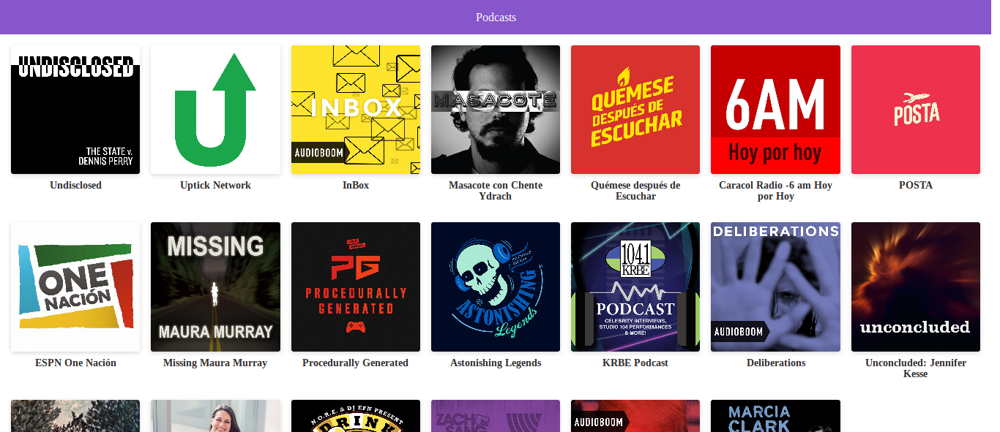

# App de Podcasts de Platzi

App de podcast integrada con la API de AudioBoom para aprender Next.JS

[Ver la aplicación](https://podcasts-qvwxyhsfac.now.sh/)

## ¿Cómo funciona?

Requiere Node.JS

* `npm install` para instalar las dependencias
* `npm run dev ` para el entorno de desarrollo
* `npm run build && npm start ` para el entorno de producción

## Licencia

MIT
